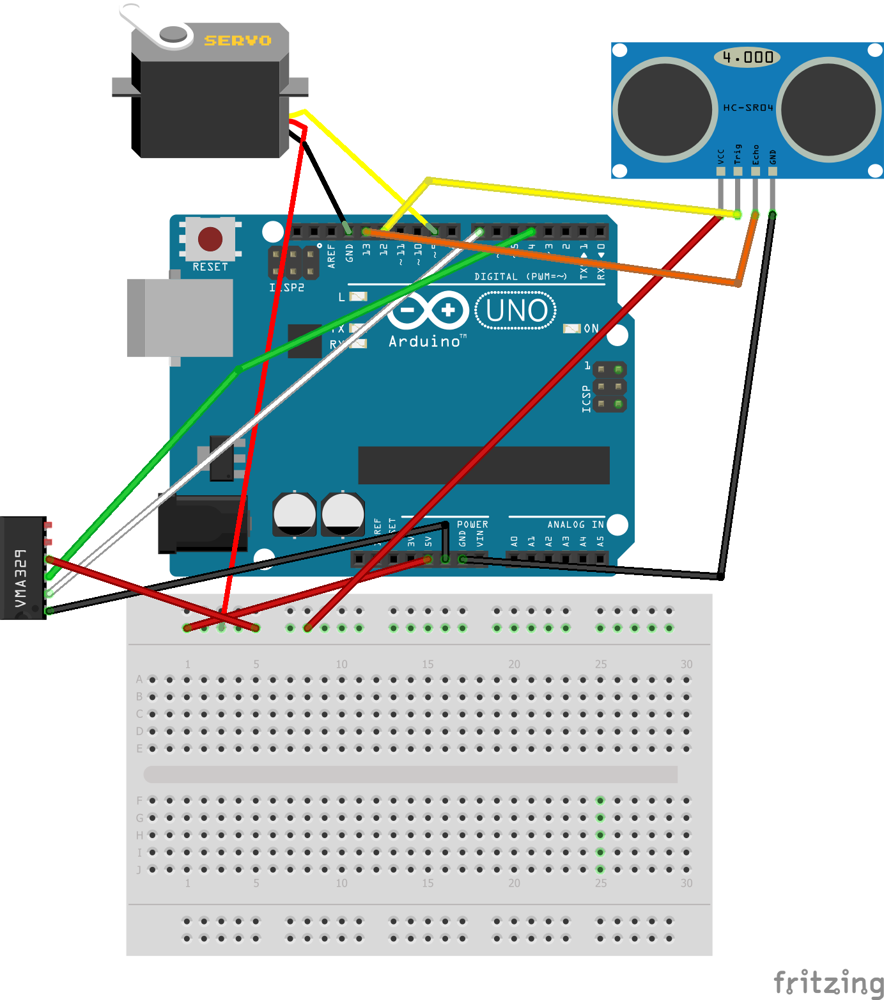

# The Whaddy Safe Gate

This example is an automated garage door.
The example program rotates a servo when the correct finger is placed on the fingerprint sensor and nothing is in front of the distance sensor.

## Library dependencies
* Adafruit_Fingerprint.h
* Servo.h

## Wiring diagram

